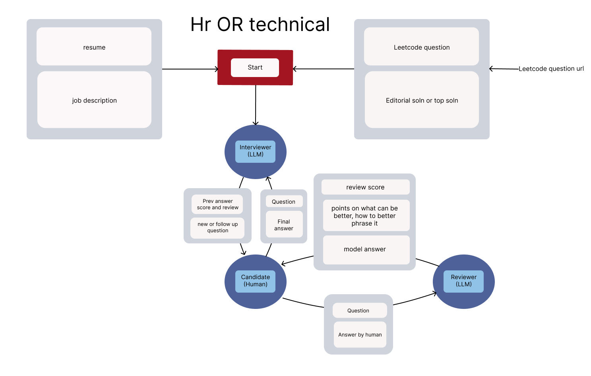

A simple interviewer(llm)-candidate(human)-reviewer(llm) loop to assist in prepping for interviews.  
Here's the flow of how it works:  


And here's a video demo:
[video demo](https://youtu.be/8-2WKFsty0Y)


## Installation
1. Clone the repo
2. Installing the libraries-  
Because we have a backend and a frontend, we need to install the libraries for both.
2.1 Backend:  
```bash
cd backend
npm install
```
2.2 Frontend:  
```bash
cd frontend
pnpm install
```
(i think that should work, no promises sorry! 😅)
3. Running
3.1 Backend:  
```bash
cd backend
npm run start
```
3.2 Frontend: (in another parallel terminal)
```bash
cd frontend
pnpm dev
```


